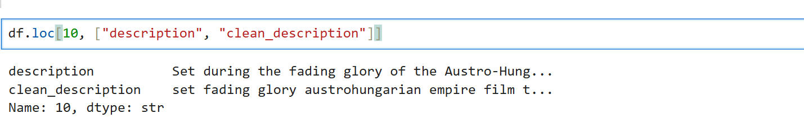
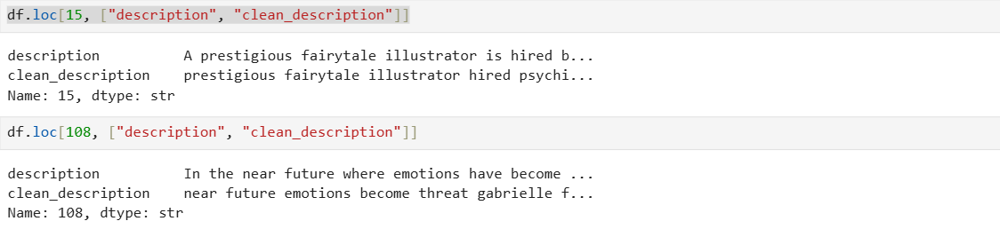
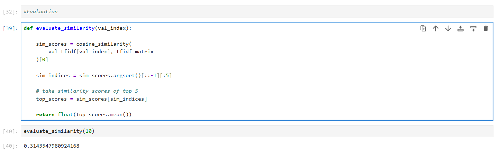

# Content-Based Movie Recommendation System

## Overview

This project implements a **content-based movie recommendation system** using movie plot descriptions.  
Movies are recommended based on textual similarity computed using **TF-IDF vectorization** and **cosine similarity**.

The dataset used is the **IMDB Genres dataset** from HuggingFace.

---

## Dataset

Dataset: `jquigl/imdb-genres`

Used fields:

- movie title - year
- description
- genre
- rating

Train split → build model  
Validation split → test recommendations

---

## Data Preprocessing

The following preprocessing steps were applied to movie descriptions:

- Convert text to lowercase
- Remove punctuation
- Remove stopwords using NLTK
- Create a cleaned description column

Examples:
Original:

Set during the fading glory of the Austro-Hungarian empire...

Cleaned:

set fading glory austrohungarian empire film




---

## Vectorization

TF-IDF (Term Frequency–Inverse Document Frequency) was used to convert movie descriptions into numerical vectors.

- Captures importance of meaningful words
- Reduces influence of common words
- Limits vocabulary size to 5000 features

```python
tfidf = TfidfVectorizer(max_features=5000)
tfidf_matrix = tfidf.fit_transform(df["clean_description"])
```

## Recommendation Logic

The recommendation system follows these steps:

Convert movie descriptions into TF-IDF vectors
Compute cosine similarity between movies
Sort similarity scores
Return top 5 most similar movies

## Input:

Movie title / validation movie

## Output:

Top 5 similar movies

## Train / Validation Strategy

The dataset was divided into **train** and **validation** subsets to properly evaluate the recommendation system.

### Train Dataset

- Used to fit the **TF-IDF vectorizer**
- Serves as the **recommendation pool**
- Movie similarity is computed against this dataset

### Validation Dataset

- Used to **test recommendations**
- Transformed using the trained TF-IDF model

```python
val_tfidf = tfidf.transform(val_df["clean_description"])
```

### Evaluation


